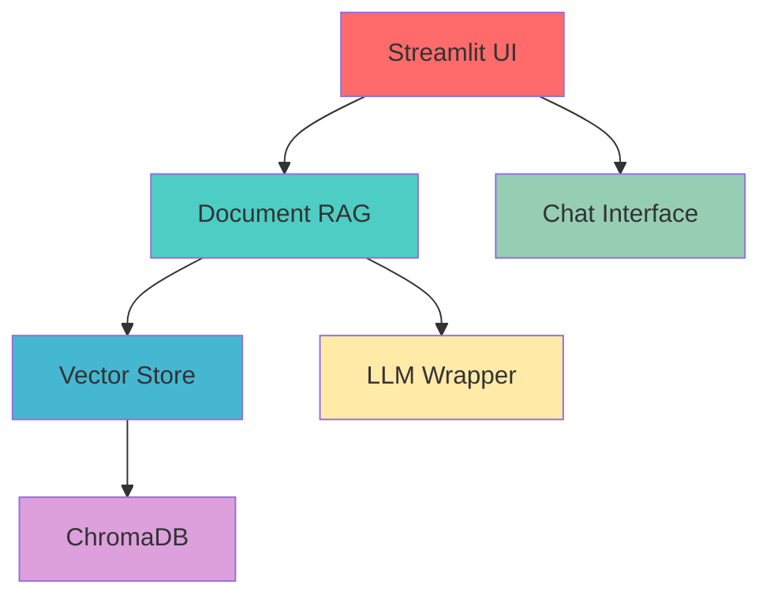

#  DoqToq

**Documents that talk — DoqToq**

> Transform your documents into intelligent conversational partners. DoqToq brings your PDFs, text files, and documents to life with AI-powered personality and deep understanding.

[](https://streamlit.io)
[](https://langchain.com)
[](https://python.org)

## What is DoqToq?

DoqToq is an advanced **Retrieval-Augmented Generation (RAG)** system that makes your documents speak in first person with personality. Upload any document, and it becomes a knowledgeable conversational partner that can answer questions about its own content with intelligence and character.

### Key Features

- **Multi-LLM Support**: Choose between Google Gemini, Mistral AI, or local Ollama models
- **Universal Document Support**: PDF, TXT, JSON, and Markdown files
- **Real-time Streaming**: Watch responses appear word-by-word with customizable speed
- **Advanced Controls**: Fine-tune temperature, retrieval parameters, and embedding models
- **Smart Retrieval**: Intelligent document chunking with relevance scoring
- **Built-in Safety**: Prompt injection protection and off-topic detection
- **Document Personality**: Your documents respond with character and first-person perspective
- **Memory**: Maintains conversation context for natural dialogue flow

## Quick Start

### Prerequisites

- Python 3.12+
- Conda (recommended)

### Installation

1. **Clone the repository**
   ```bash
   git clone git@github.com:shre-db/doqtoq.git
   cd doqtoq
   ```

2. **Create the environment**
   ```bash
   conda env create -f environment.yaml
   conda activate doqtoq
   ```

3. **Set up API keys** (create a `.env` file)
   ```env
   GOOGLE_API_KEY=your_google_api_key_here
   MISTRAL_API_KEY=your_mistral_api_key_here
   ```

4. **Launch DoqToq**
   ```bash
   chmod +x start_app.sh
   ./start_app.sh
   ```

   Or manually:
   ```bash
   streamlit run app/main.py
   ```

5. **Open your browser** to `http://localhost:8501`

## How to Use

1. **Upload** your document (PDF, TXT, JSON, or MD)
2. **Watch** as DoqToq reads and indexes your content
3. **Ask** questions in natural language
4. **Enjoy** intelligent, contextual responses with source citations

### Example Conversations

```
You: "What's the main theme of this document?"
Document: "As I understand myself, my primary theme revolves around..."

You: "Can you summarize the key points?"
Document: "Having reflected on my contents, here are the essential ideas I contain..."
```

## Advanced Configuration

### LLM Options
- **Google Gemini**: Fast, capable, cloud-based
- **Mistral AI**: European AI with strong reasoning
- **Ollama**: Local models for privacy and offline use

### Embedding Models
- **HuggingFace**: `all-MiniLM-L6-v2` (default), `all-mpnet-base-v2`
- **Local**: Various Sentence-Transformers models

### Customization
- **Temperature**: Control response creativity (0.0 - 1.0)
- **Retrieval Depth**: Adjust how many document sections to consider
- **Streaming Speed**: Customize response delivery timing

## Architecture

DoqToq is built with modern AI and web technologies:



### Core Components

- **Frontend**: Streamlit with custom CSS and responsive design
- **Backend**: LangChain-powered RAG pipeline with flexible LLM support
- **Vector Database**: ChromaDB for efficient similarity search
- **Document Processing**: Intelligent chunking and embedding
- **Safety Layer**: Prompt injection and off-topic detection

## Features Deep Dive

### Document Personality
Your documents don't just answer questions, they embody their content. DoqToq uses carefully crafted prompts to give documents a distinctive voice and perspective.

### Smart Relevance Scoring
Advanced similarity metrics help you understand how well the AI matched your question to document content:
- **High Relevance**: Direct content matches (green)
- **Medium Relevance**: Related content (yellow)  
- **Low Relevance**: Tangential matches (red)

### Streaming Intelligence
Choose your streaming experience:
- **Instant**: Maximum speed
- **Character-by-character**: Typewriter effect
- **Word-by-word**: Natural reading pace
- **Custom delays**: Fine-tune to your preference

### Built-in Security
- Prompt injection detection and mitigation
- Off-topic query handling with graceful responses
- Content filtering for inappropriate requests

## Development

### Project Structure

```
doqtoq/
├── app/                                       # Streamlit Frontend Application
│   ├── main.py                                # Main application entry point
│   ├── chat.py                                # Chat interface and conversation handling
│   ├── sidebar.py                             # Settings and configuration sidebar
│   ├── uploader.py                            # Document upload functionality
│   ├── streaming_queue.py                     # Real-time response streaming system
│   ├── styles.py                              # Custom CSS and UI styling
│   ├── config.py                              # Session state and app configuration
│   └── utils.py                               # UI utility functions and icon loading
│
├── backend/                                   # Core AI and RAG Engine
│   ├── rag_engine.py                          # Main RAG pipeline orchestrator
│   ├── chunker.py                             # Document parsing and text chunking
│   ├── embedder.py                            # Embedding model management (HF, Mistral)
│   ├── llm_wrapper.py                         # LLM abstraction (Gemini, Mistral, Ollama)
│   ├── retriever.py                           # Vector similarity search and retrieval
│   ├── utils.py                               # Backend utilities and safety checks
│   │
│   ├── prompts/                               # AI Prompt Engineering
│   │   ├── prompt_templates.py                # Dynamic prompt generation
│   │   ├── system_prompt.md                   # Core document personality prompt
│   │   ├── off_topic_prompt.md                # Off-topic response template
│   │   ├── off_topic_detection_prompt.md      # Topic relevance detection
│   │   └── prompt_injection_response.md       # Security response template
│   │
│   └── vectorstore/                           # Vector Database Management
│       ├── vector_db.py                       # ChromaDB integration and operations
│       └── index/                             # Persistent vector storage
│
├── assets/                                    # Visual Resources and Branding
│   ├── DoqToq-logo.svg                        # Main application logo
│   ├── scroll-light.svg                       # Document avatar icon
│   ├── user-light.svg                         # User avatar icon
│   ├── faders-horizontal-fill.svg             # Settings icon
│   ├── sparkle-light.svg                      # AI magic indicator
│   ├── gear-light.svg                         # Configuration icon
│   └── quill.png                              # Writing/streaming indicator
│
├── data/                                      # Document Storage and Processing
│   ├── uploads/                               # Temporary uploaded file storage
│   └── sample_docs/                           # Example documents for testing
│
├── utils/                                     # System Utilities
│   ├── suppress_warnings.py                   # Warning suppression for clean output
│   └── torch_compatibility.py                 # PyTorch and Streamlit compatibility fixes
│
├── tests/                                     # Testing and Performance
│   ├── test_streaming_performance.py          # Streaming response benchmarks
│   └── streaming_performance_report_*.json    # Performance test results
│
├── logs/                                      # Application Logging
│   └── latex_streaming_debug_*.log            # Streaming debug and performance logs
│
├── alternatives/                              # Experimental Features
│   └── streaming_queue_multithreaded.py       # Advanced streaming implementations
├── environment.yaml                           # Conda environment specification
├── start_app.sh                               # Application startup script
├── Dockerfile.venv                            # Container deployment configuration for virtual environment
├── Dockerfile.conda                           # Container deployment configuration for conda environment
├── .env.example                               # Environment variables template
├── .gitignore                                 # Git ignore patterns
├── LICENSE.md                                 # Apache 2.0 license terms
├── .vscode/                                   # VS Code workspace settings
├── .streamlit/                                # Streamlit configuration
└── .dockerignore                              # Docker build ignore patterns
```

#### Architecture Breakdown

##### Frontend Layer (`app/`)
- **Streamlit-powered** responsive web interface
- **Real-time streaming** with customizable speed controls
- **Interactive sidebar** for model and parameter configuration
- **Drag-and-drop** document upload with format validation
- **Custom CSS styling** for professional appearance

##### AI Engine (`backend/`)
- **Multi-LLM support** with unified API abstraction
- **Advanced RAG pipeline** with document personality injection
- **Flexible embedding** models (HuggingFace, Mistral, local)
- **ChromaDB integration** for efficient vector operations
- **Safety mechanisms** including prompt injection detection

##### Prompt Engineering (`backend/prompts/`)
- **Dynamic prompt templates** with context injection
- **Document personality system** for first-person responses
- **Safety prompts** for handling inappropriate queries
- **Topic detection** for maintaining conversation relevance

##### Vector Operations (`backend/vectorstore/`)
- **ChromaDB** for persistent vector storage
- **Similarity search** with relevance scoring
- **Efficient indexing** for fast document retrieval
- **Automatic cleanup** for fresh document processing

### Contributing
We welcome contributions! Please see our development guidelines for more information.

## Docker Support

DoqToq supports containerized deployment with two Docker configurations:

### Virtual Environment Version (Recommended)
```bash
# Build the image with virtual environment
docker build -f Dockerfile.venv -t doqtoq:venv .

# Run the container
docker run -p 8501:8501 doqtoq:venv
```

### Conda Environment Version
```bash
# Build the image with conda environment
docker build -f Dockerfile.conda -t doqtoq:conda .

# Run the container
docker run -p 8501:8501 doqtoq:conda
```

### Docker with Environment Variables
```bash
# Run with API keys
docker run -p 8501:8501 \
   -e GOOGLE_API_KEY=your_google_api_key \
   -e MISTRAL_API_KEY=your_mistral_api_key \
   doqtoq:venv
```

### Docker Compose (Optional)
Create a `docker-compose.yml` for easier management:
```yaml
version: '3.8'
services:
   doqtoq:
      build:
         context: .
         dockerfile: Dockerfile.venv
      ports:
         - "8501:8501"
      environment:
         - GOOGLE_API_KEY=${GOOGLE_API_KEY}
         - MISTRAL_API_KEY=${MISTRAL_API_KEY}
      volumes:
         - ./data:/app/data
```

Then run:
```bash
docker-compose up
```

## Performance

DoqToq is optimized for:
- **Fast document processing**: Parallel chunking and embedding
- **Efficient retrieval**: Vector similarity search with relevance scoring
- **Responsive streaming**: Sub-second response initiation
- **Memory efficiency**: Intelligent caching and state management

## Community & Support

- **Issues**: Report bugs and request features in our issue tracker
- **Discussions**: Join the community for questions and sharing
- **Documentation**: Comprehensive guides and API reference

## License

Details will be updated soon.

---

**Made with ❤️ for the AI community. Give your documents a voice with DoqToq!**