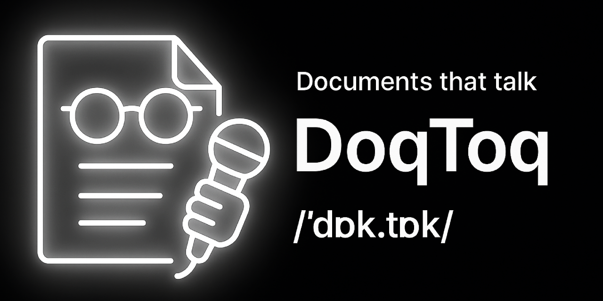
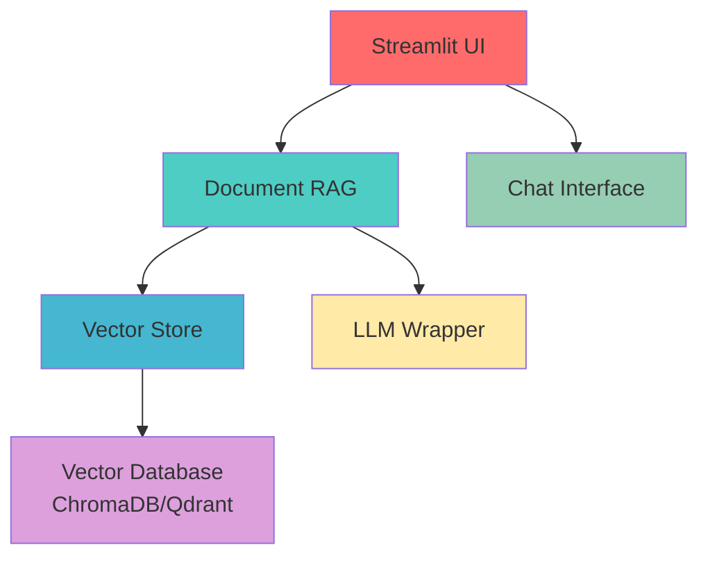
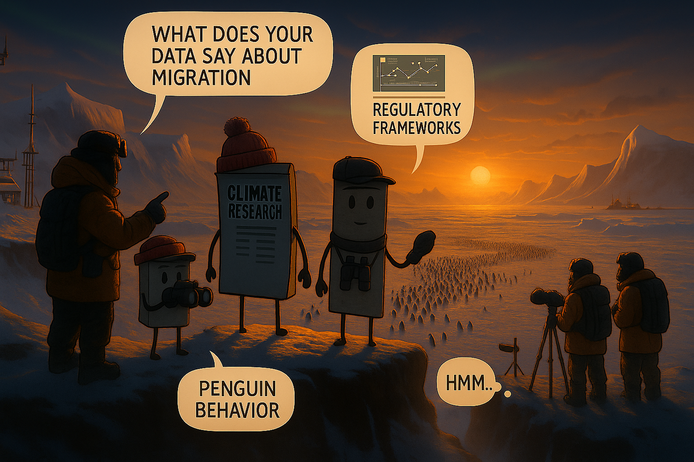
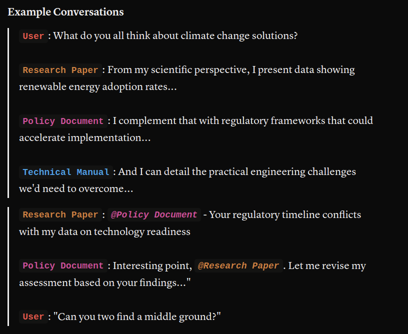

<div style="display: inline-flex; align-items: center;">
  
  <span style="margin-left: 5px; font-size: 2.7em; color: white;"><b>DoqToq</b></span>
</div>


**Documents that talk — DoqToq**

**/ˈdɒk.tɒk/**
> Transform your documents into intelligent conversational partners. DoqToq brings your PDFs, text files, and documents to life with AI-powered personality and deep understanding.

[](https://streamlit.io)
[](https://langchain.com)
[](https://python.org)
[](https://docker.com)
[](LICENSE.md)
[](#production--performance-features)



## What is DoqToq?

DoqToq is an **AI-Augmented Document platform** that transforms static documents into living, conversational entities. Unlike traditional systems that use documents to augment AI, DoqToq uses AI to augment documents—bringing them to life with personality, self-awareness, and the ability to engage in meaningful dialogue about their own contents.

**Core Philosophy**: Your documents don't just contain knowledge—they *become* knowledgeable. Each document develops its own voice, understands its structure and themes, and can discuss itself in first-person with intelligence and personality.

> 📖 **Deep Dive**: Learn more about our revolutionary approach in our [Philosophy Document](docs/PHILOSOPHY.md)

### Key Features

- **Multi-LLM Support**: Choose between Google Gemini, Mistral AI, or local Ollama models
- **Dual Vector Database Support**: Choose between ChromaDB and Qdrant for optimal performance
- **Universal Document Support**: PDF, TXT, JSON, and Markdown files
- **Real-time Streaming**: Watch responses appear word-by-word with customizable speed
- **Advanced Configuration**: Pydantic-based configuration management with flexible deployment options
- **Smart Retrieval**: Intelligent document chunking with relevance scoring and hybrid search
- **Built-in Safety**: Prompt injection protection and off-topic detection
- **Document Personality**: Your documents respond with character and first-person perspective
- **Memory**: Maintains conversation context for natural dialogue flow
- **Production Ready**: Comprehensive testing, CI/CD, and deployment infrastructure
- **Developer Friendly**: Full development toolkit with automated setup and quality checks

## Quick Start

### Prerequisites

- Python 3.10+ (3.12+ recommended)
- Conda (recommended) or pip
- Git

### System Requirements

#### Minimum Requirements
- **RAM**: 4GB (8GB recommended)
- **Storage**: 2GB free space
- **CPU**: 2 cores (4+ cores recommended)
- **Network**: Internet connection for cloud LLM APIs

#### Recommended for Production
- **RAM**: 16GB+ for large document processing
- **Storage**: SSD with 10GB+ free space
- **CPU**: 8+ cores for concurrent users
- **Network**: High-bandwidth connection for streaming

#### Supported Platforms
- **Linux**: Ubuntu 20.04+, CentOS 8+, Debian 11+
- **macOS**: 10.15+ (Intel and Apple Silicon)
- **Windows**: 10/11 with WSL2 (recommended) or native
- **Docker**: Any platform supporting Docker 20.10+

### Installation

Choose your preferred installation method:

#### Option 1: Automated Installation (Recommended)
```bash
# Clone the repository
git clone https://github.com/shre-db/doqtoq.git
cd doqtoq

# Run the installation script
./install.sh --method conda --dev

# Activate environment
conda activate doqtoq
```

#### Option 2: Manual Installation
```bash
# Clone the repository
git clone https://github.com/shre-db/doqtoq.git
cd doqtoq

# Create environment using conda
conda env create -f environment.yaml
conda activate doqtoq

# Or using pip
python -m venv doqtoq-env
source doqtoq-env/bin/activate  # On Windows: doqtoq-env\Scripts\activate
pip install -r requirements.txt
```

#### Option 3: Development Setup
```bash
# For contributors and developers
git clone https://github.com/shre-db/doqtoq.git
cd doqtoq

# Set up development environment with testing tools
make setup-dev
```

### Configuration

1. **Set up API keys** (create a `.env` file from template)
   ```bash
   cp .env.example .env
   # Edit .env with your API keys and vector database preferences
   ```

2. **Configure Vector Database** (optional - defaults to Qdrant)
   ```bash
   # In your .env file:
   VECTOR_DB_PROVIDER=qdrant  # or "chroma"
   QDRANT_MODE=local          # or "server" for remote Qdrant
   ```

3. **Install Qdrant** (if using Qdrant - recommended)
   ```bash
   # Automated Qdrant setup
   ./install_qdrant.sh

   # Or use Docker Compose with Qdrant profile
   docker-compose --profile qdrant up -d
   ```

4. **Launch DoqToq**
   ```bash
   # Using the startup script
   ./start_app.sh

   # Or directly with Streamlit
   streamlit run app/main.py

   # Or using Make
   make run
   ```

5. **Open your browser** to `http://localhost:8501`

## How to Use

1. **Upload** your document (PDF, TXT, JSON, or MD)
2. **Watch** as DoqToq reads and indexes your content
3. **Ask** questions in natural language
4. **Enjoy** intelligent, contextual responses with source citations

### Example Conversations

```
You: "What's the main theme of this document?"
Document: "As I understand myself, my primary theme revolves around..."

You: "Can you summarize the key points?"
Document: "Having reflected on my contents, here are the essential ideas I contain..."
```

## Advanced Configuration

### LLM Options
- **Google Gemini**: Fast, capable, cloud-based
- **Mistral AI**: European AI with strong reasoning
- **Ollama**: Local models for privacy and offline use

### Vector Database Options
- **Qdrant**: High-performance vector database (recommended for production)
- **ChromaDB**: Lightweight vector database (good for development)

### Embedding Models
- **HuggingFace**: `all-MiniLM-L6-v2` (default), `all-mpnet-base-v2`
- **Local**: Various Sentence-Transformers models

### Customization
- **Temperature**: Control response creativity (0.0 - 1.0)
- **Retrieval Depth**: Adjust how many document sections to consider
- **Streaming Speed**: Customize response delivery timing
- **Vector Database**: Choose between Qdrant and ChromaDB
- **Database Configuration**: Local, server, or cloud deployment options

## Architecture

DoqToq is built with modern AI and web technologies:



### Core Components

- **Frontend**: Streamlit with custom CSS and responsive design
- **Backend**: LangChain-powered RAG pipeline with flexible LLM support
- **Vector Database**: Dual support for ChromaDB and Qdrant with unified interface
- **Document Processing**: Intelligent chunking and embedding with configurable models
- **Configuration Management**: Pydantic-based configuration with environment flexibility
- **Safety Layer**: Prompt injection and off-topic detection

## Features Deep Dive

### Document Personality
Your documents don't just answer questions, they embody their content. DoqToq uses carefully crafted prompts to give documents a distinctive voice and perspective.

### Smart Relevance Scoring
Advanced similarity metrics help you understand how well the AI matched your question to document content:
- **High Relevance**: Direct content matches (green)
- **Medium Relevance**: Related content (yellow)
- **Low Relevance**: Tangential matches (red)

### Streaming Intelligence
Choose your streaming experience:
- **Instant**: Maximum speed
- **Character-by-character**: Typewriter effect
- **Word-by-word**: Natural reading pace
- **Custom delays**: Fine-tune to your preference

### Built-in Security
- Prompt injection detection and mitigation
- Off-topic query handling with graceful responses
- Content filtering for inappropriate requests

## API & Programmatic Usage

DoqToq provides a comprehensive API for integration with other applications.
For complete API documentation, see [docs/API.md](docs/API.md).

## Development

### Project Structure

```
doqtoq/
├── app/                                       # Streamlit Frontend Application
│   ├── main.py                                # Main application entry point
│   ├── chat.py                                # Chat interface and conversation handling
│   ├── sidebar.py                             # Settings and configuration sidebar
│   ├── uploader.py                            # Document upload functionality
│   ├── streaming_queue.py                     # Real-time response streaming system
│   ├── styles.py                              # Custom CSS and UI styling
│   ├── config.py                              # Session state and app configuration
│   └── utils.py                               # UI utility functions and icon loading
│
├── backend/                                   # Core AI and RAG Engine
│   ├── rag_engine.py                          # Main RAG pipeline orchestrator
│   ├── chunker.py                             # Document parsing and text chunking
│   ├── embedder.py                            # Embedding model management (HF, Mistral)
│   ├── llm_wrapper.py                         # LLM abstraction (Gemini, Mistral, Ollama)
│   ├── retriever.py                           # Vector similarity search and retrieval
│   ├── utils.py                               # Backend utilities and safety checks
│   │
│   ├── prompts/                               # AI Prompt Engineering
│   │   ├── prompt_templates.py                # Dynamic prompt generation
│   │   ├── system_prompt.md                   # Core document personality prompt
│   │   ├── off_topic_prompt.md                # Off-topic response template
│   │   ├── off_topic_detection_prompt.md      # Topic relevance detection
│   │   └── prompt_injection_response.md       # Security response template
│   │
│   └── vectorstore/                           # Vector Database Management
│       ├── __init__.py                        # Package initialization
│       ├── base.py                            # Abstract base interface
│       ├── factory.py                         # Database factory pattern
│       ├── config.py                          # Pydantic configuration models
│       ├── chroma_db.py                       # ChromaDB implementation
│       ├── qdrant_db.py                       # Qdrant implementation
│       ├── vector_db.py                       # Legacy compatibility wrapper
│       ├── migrations.py                      # Database migration utilities
│       └── index/                             # Persistent vector storage
│
├── assets/
│   ├── doqtoq_cover_photo.png                 # Banner image
│   ├── DoqToq-logo.svg                        # Main application logo
│   ├── scroll-light.svg                       # Document avatar icon
│   ├── scroll-duotone.svg                     # Alternative document icon
│   ├── user-light.svg                         # User avatar icon
│   ├── user-fill.svg                          # Alternative user avatar icon
│   ├── faders-horizontal-fill.svg             # Settings icon
│   ├── sparkle-light.svg                      # AI magic indicator
│   ├── gear-light.svg                         # Configuration icon
│   ├── quill.png                              # Writing/streaming indicator
│   └── read-cv-logo.svg                       # Additional branding asset
│
├── data/                                      # Document Storage and Processing
│   ├── uploads/                               # Temporary uploaded file storage
│   ├── sample_docs/                           # Example documents for testing
│   └── vectorstore/                           # Unified vector database storage
│       ├── chroma/                            # ChromaDB data directory
│       └── qdrant/                            # Qdrant data directory
│
├── tests/                                     # Comprehensive Testing Suite
│   ├── test_rag_engine.py                     # RAG pipeline tests
│   ├── test_streaming_performance.py          # Performance benchmarks
│   └── streaming_performance_report_*.json    # Performance test results
│
├── docs/                                      # Documentation
│   ├── PHILOSOPHY.md                          # Core philosophy and revolutionary vision
│   ├── API.md                                 # API reference documentation
│   ├── DEPLOYMENT.md                          # Deployment guide
│   ├── FUTURE_ROADMAP.md                      # Future development roadmap
│   └── README.md                              # Documentation overview
│
├── utils/                                     # System Utilities
│   ├── suppress_warnings.py                   # Warning suppression for clean output
│   ├── torch_compatibility.py                 # PyTorch and Streamlit compatibility fixes
│   └── logging_method.py                      # Centralized logging configuration
│
├── logs/                                      # Application Logging
│   └── app.log                                # Application logs
│
├── alternatives/                              # Experimental Features
│   └── streaming_queue_multithreaded.py       # Advanced streaming implementations
│
├── .github/                                   # GitHub Integration
│   ├── workflows/                             # CI/CD pipelines
│   └── ISSUE_TEMPLATE/                        # Issue templates
│
├── environment.yaml                           # Conda environment specification
├── requirements.txt                           # Production dependencies
├── requirements-dev.txt                       # Development dependencies
├── pyproject.toml                             # Project configuration and testing
├── setup.py                                   # Package distribution setup
├── MANIFEST.in                                # Package manifest for distribution
├── Makefile                                   # Development automation
├── install.sh                                 # Automated installation script
├── install_qdrant.sh                          # Qdrant installation and setup script
├── start_app.sh                               # Application startup script
├── docker-compose.yml                         # Production deployment
├── Dockerfile.venv                            # Container deployment (venv)
├── Dockerfile.conda                           # Container deployment (conda)
├── .pre-commit-config.yaml                    # Code quality automation
├── CONTRIBUTING.md                            # Contribution guidelines
├── SECURITY.md                                # Security policy
├── CHANGELOG.md                               # Version history
├── PRODUCTION_READINESS.md                    # Production checklist
├── NOTICE                                     # Legal notices and attributions
├── .env.example                               # Environment variables template
├── .gitignore                                 # Git ignore patterns
├── LICENSE.md                                 # Apache 2.0 license terms
├── .vscode/                                   # VS Code workspace settings
├── .streamlit/                                # Streamlit configuration
└── .dockerignore                              # Docker build ignore patterns
```

### Development Commands

DoqToq includes a comprehensive development environment with automated tooling:

```bash
# Set up development environment
make setup-dev

# Run tests
make test                   # Run all tests
make test-cov               # Run tests with coverage
make test-unit              # Run unit tests only
make test-integration       # Run integration tests only

# Code quality
make lint                   # Run all linting checks
make format                 # Format code with black and isort
make type-check             # Run type checking with mypy
make security-check         # Run security checks
make pre-commit             # Run pre-commit hooks

# Development tasks
make clean                  # Clean temporary files
make docs                   # Generate documentation
make release-check          # Verify production readiness

# Docker development
make docker-build           # Build Docker images
make docker-run             # Run in Docker container
```

### Testing Infrastructure

DoqToq includes comprehensive testing with:

- **Unit Tests**: Individual component testing
- **Integration Tests**: End-to-end workflow testing
- **Performance Tests**: Streaming and response time benchmarks
- **Security Tests**: Safety and prompt injection testing
- **Coverage Reports**: Detailed coverage analysis (target: 70%+)

```bash
# Run specific test categories
pytest tests/ -m unit              # Unit tests only
pytest tests/ -m integration       # Integration tests only
pytest tests/ -m streaming         # Streaming tests only
pytest tests/ -m safety            # Security tests only
```

### Code Quality & CI/CD

- **Pre-commit hooks**: Automated code formatting and linting
- **GitHub Actions**: Continuous integration and testing
- **Security scanning**: Vulnerability detection and dependency checking
- **Type checking**: MyPy for type safety
- **Code formatting**: Black and isort for consistent style

## Docker Support

DoqToq supports containerized deployment with comprehensive Docker configurations:

### Docker Compose (Recommended for Production)
```bash
# Clone and configure
git clone https://github.com/shre-db/doqtoq.git
cd doqtoq
cp .env.example .env  # Add your API keys

# Start with Docker Compose
docker-compose up -d

# View logs
docker-compose logs -f doqtoq

# Stop services
docker-compose down
```

### Docker Build Options

#### Virtual Environment Version (Recommended)
```bash
# Build the image
docker build -f Dockerfile.venv -t doqtoq:venv .

# Run the container
docker run -p 8501:8501 \
   -e GOOGLE_API_KEY=your_google_api_key \
   -e MISTRAL_API_KEY=your_mistral_api_key \
   -v $(pwd)/data:/app/data \
   doqtoq:venv
```

#### Conda Environment Version
```bash
# Build the image
docker build -f Dockerfile.conda -t doqtoq:conda .

# Run the container
docker run -p 8501:8501 \
   -e GOOGLE_API_KEY=your_google_api_key \
   -e MISTRAL_API_KEY=your_mistral_api_key \
   doqtoq:conda
```

### Production Deployment Features
- **Health checks** with automatic restart policies
- **Volume persistence** for data and logs
- **Network isolation** with custom networks
- **Nginx reverse proxy** support (optional)
- **Environment variable** management
- **Resource limits** and monitoring ready

## Cloud Deployment

DoqToq is designed for easy deployment across major cloud platforms:

### Platform Support
- **AWS**: ECS, EC2, and Elastic Beanstalk ready
- **Google Cloud**: Cloud Run and Compute Engine compatible
- **Azure**: Container Instances and App Service ready
- **DigitalOcean**: App Platform and Droplets supported
- **Heroku**: Container stack deployment ready

### One-Click Deployments
```bash
# AWS ECS with Fargate
aws ecs create-service --service-name doqtoq --task-definition doqtoq:latest

# Google Cloud Run
gcloud run deploy doqtoq --image gcr.io/PROJECT_ID/doqtoq --platform managed

# Azure Container Instances
az container create --resource-group myRG --name doqtoq --image doqtoq:latest
```

For detailed deployment instructions, see our [Deployment Guide](docs/DEPLOYMENT.md).

## Vector Database Configuration

DoqToq supports two high-performance vector databases with a unified interface:

### Qdrant (Recommended)
Qdrant offers superior performance and scalability for production deployments.

#### Quick Setup
```bash
# Automated installation and configuration
./install_qdrant.sh

# Or using Docker Compose
docker-compose --profile qdrant up -d
```

#### Configuration Options
```bash
# Local mode (binary installation)
VECTOR_DB_PROVIDER=qdrant
QDRANT_MODE=local
QDRANT_PATH=./data/vectorstore/qdrant

# Server mode (Docker or remote)
QDRANT_MODE=server
QDRANT_URL=http://localhost:6333

# Advanced options
QDRANT_PREFER_GRPC=true        # Better performance
QDRANT_API_KEY=your-api-key    # For Qdrant Cloud
```

### ChromaDB (Development)
Lightweight option perfect for development and testing.

```bash
VECTOR_DB_PROVIDER=chroma
```

### Database Migration
Switch between databases seamlessly:
```bash
# Your documents will be re-indexed automatically
# when switching vector database providers
```

For detailed Qdrant setup instructions, see [docs/QDRANT_INSTALLATION.md](docs/QDRANT_INSTALLATION.md).

## Performance & Production Features

DoqToq is optimized for production deployment with:

### Performance Optimizations
- **Fast document processing**: Parallel chunking and embedding
- **Efficient retrieval**: Vector similarity search with relevance scoring and hybrid database support
- **Responsive streaming**: Sub-second response initiation
- **Memory efficiency**: Intelligent caching and state management
- **Concurrent handling**: Multi-user support with session isolation
- **Database flexibility**: Choose optimal vector database for your use case

### Production Infrastructure
- **Comprehensive logging**: Structured logging with rotation and levels
- **Health monitoring**: Built-in health checks and status endpoints
- **Error handling**: Graceful degradation and user-friendly error messages
- **Resource management**: Configurable memory and processing limits
- **Scalability**: Container-ready with horizontal scaling support

### Security Features
- **API key management**: Secure environment variable handling
- **Input validation**: Comprehensive request validation and sanitization
- **Rate limiting**: Configurable request throttling
- **Content filtering**: Built-in safety mechanisms
- **Vulnerability scanning**: Automated security dependency checking

### Monitoring & Observability
- **Performance metrics**: Response times, throughput, and resource usage
- **Application logs**: Structured logging with multiple levels
- **Error tracking**: Comprehensive error logging and reporting
- **Health checks**: Container and application health monitoring

## Troubleshooting

### Common Issues

#### Installation Problems
```bash
# Check Python version
python --version  # Should be 3.10+

# Clean install
make clean
./install.sh --method conda --clean

# Check dependencies
pip check
```

#### Runtime Issues
```bash
# Check logs
tail -f logs/app.log

# Verify environment
streamlit doctor

# Test API connectivity
curl -f http://localhost:8501/_stcore/health
```

#### Docker Issues
```bash
# Check container status
docker-compose ps

# View container logs
docker-compose logs -f doqtoq

# Restart services
docker-compose restart
```

### Performance Tuning
- **Memory**: Increase Docker memory limits for large documents
- **CPU**: Use multi-core deployment for high throughput
- **Storage**: Use SSD storage for vector database performance
- **Network**: Configure CDN for static assets in production

### Support Resources
- Check the [troubleshooting guide](docs/DEPLOYMENT.md#troubleshooting)
- Search existing [GitHub issues](https://github.com/shre-db/doqtoq/issues)
- Review [performance benchmarks](tests/)

## Community & Support

### Documentation
- **[Philosophy Document](docs/PHILOSOPHY.md)**: Core principles and revolutionary vision of AI-augmented documents
- **[API Reference](docs/API.md)**: Complete API documentation
- **[Deployment Guide](docs/DEPLOYMENT.md)**: Comprehensive deployment instructions
- **[Qdrant Installation Guide](docs/QDRANT_INSTALLATION.md)**: Vector database setup and configuration
- **[Future Roadmap](docs/FUTURE_ROADMAP.md)**: Planned features and development roadmap
- **[Production Readiness](docs/PRODUCTION_READINESS.md)**: Production deployment checklist
- **[RAG Engine Modernization](docs/RAG_ENGINE_MODERNIZATION.md)**: Architecture improvements and updates
- **[Contributing Guidelines](CONTRIBUTING.md)**: How to contribute to DoqToq
- **[Security Policy](SECURITY.md)**: Security guidelines and vulnerability reporting
- **[Changelog](CHANGELOG.md)**: Version history and updates

### Getting Help
- **Issues**: [Report bugs and request features](https://github.com/shre-db/doqtoq/issues)
- **Discussions**: [Join community discussions](https://github.com/shre-db/doqtoq/discussions)
- **Security**: Report vulnerabilities via our [security policy](SECURITY.md)

### Contributing
We welcome contributions of all kinds! Please read our [contributing guidelines](CONTRIBUTING.md) to get started.

- **Bug Reports**: Help us improve by reporting issues
- **Feature Requests**: Suggest new features and improvements
- **Code Contributions**: Submit pull requests for fixes and features
- **Documentation**: Improve docs, tutorials, and examples
- **Testing**: Add test cases and improve coverage

### Development Workflow
1. Fork the repository
2. Create a feature branch
3. Set up development environment: `make setup-dev`
4. Make your changes with tests
5. Run quality checks: `make lint test`
6. Submit a pull request

### Release Process
DoqToq follows semantic versioning and maintains a detailed changelog. Each release goes through:
- Automated testing and quality checks
- Security scanning and vulnerability assessment
- Performance benchmarking
- Documentation updates
- Community review

## Roadmap

### Current Version (v1.x)
- ✅ Multi-LLM support (Gemini, Mistral, Ollama)
- ✅ Dual vector database support (Qdrant, ChromaDB)
- ✅ Universal document support (PDF, TXT, JSON, MD)
- ✅ Real-time streaming responses
- ✅ Advanced configuration management with Pydantic
- ✅ Production-ready infrastructure
- ✅ Comprehensive testing suite

### Community Requests
Vote on features and track progress in our [GitHub Discussions](https://github.com/shre-db/doqtoq/discussions)!

### Future Vision
Interested in what's next for DoqToq? Check out our comprehensive [Future Roadmap](docs/FUTURE_ROADMAP.md) which outlines our ambitious plans for:
- **Advanced RAG Enhancement**: GraphRAG, hybrid search, intelligent synthesis, and sophisticated retrieval techniques
- **DoqToq Groups**: Revolutionary multi-document collaboration where documents interact with each other
- **Knowledge Synthesis**: Cross-document reasoning and emergent knowledge discovery
- **Academic & Industry Integration**: Research opportunities and commercial applications

## 🔮 DoqToq Groups - Multi-Document Collaboration - Planned Feature


### Revolutionary Vision

Transform DoqToq from a document conversation tool into a **multi-document knowledge synthesis platform** where documents become collaborative entities that can interact with users and each other.

### Core Concept: Documents as Collaborative Agents

#### Multi-Document Chat Orchestration


## License

DoqToq is released under the Apache 2.0 License. See [LICENSE.md](LICENSE.md) for details.

## Acknowledgments

DoqToq is built with love using:
- [Streamlit](https://streamlit.io) for the beautiful web interface
- [LangChain](https://langchain.com) for the powerful RAG pipeline
- [ChromaDB](https://www.trychroma.com/) for efficient vector storage
- [HuggingFace](https://huggingface.co) for embedding models
- [Google Gemini](https://ai.google.dev/) for generous free API access
- [Mistral AI](https://mistral.ai/) for accessible AI model APIs
- [Ollama](https://ollama.ai/) for open-source local model support

*Please review the terms and conditions of each service for usage limits and commercial licensing.*

---
**Made with ❤️ for everyone.**

*Transform your documents into intelligent conversational partners today with DoqToq!*

---
*Last updated: July 31, 2025*
